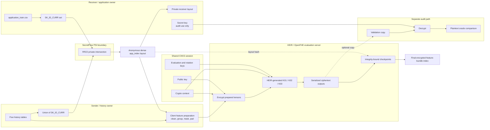
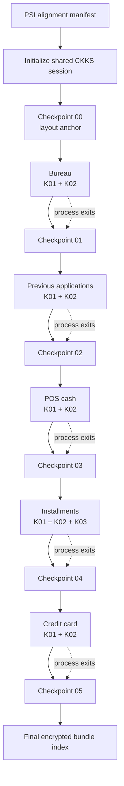
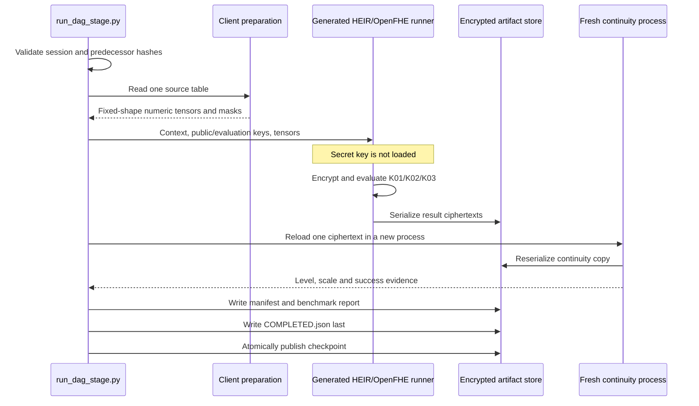
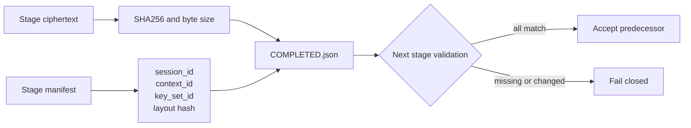

# End-to-end privacy architecture

## Scope

This architecture assesses the HE-compatible subset of the Home Credit feature
pipeline. PSI aligns applicant identifiers once. Five feature functions then
run sequentially under one CKKS session and persist encrypted sufficient
statistics. The current encrypted pipeline ends at the combined feature-bundle
index; LightGBM, rules, exact `min`/`max`, and encrypted mean/variance
finalization are outside the implemented path.

## Overall trust and data flow



The normal evaluation server never receives the secret key. Plaintext
references and audit decryption results are not valid inputs to a later
encrypted stage.

## Serial encrypted DAG

The feature branches are logically independent, but the weak-server scheduler
runs one process at a time. Every process exits only after its ciphertexts and
completion record are on disk.



Although the diagram is linear physically, a function stage reads only the
shared session, applicant layout, its own source table, and its prepared
tensors. It does not load the previous functions' ciphertext values. The new
checkpoint appends file references to the previous checkpoint.

## One function stage



## Persistent artifact layout

```text
benchmark_runs/dag/<run-id>/
├── dag_manifest.json
├── session/
│   ├── public/
│   │   ├── crypto_context.bin
│   │   ├── public_key.bin
│   │   ├── evaluation_mult_keys.bin
│   │   └── evaluation_rotation_keys.bin
│   ├── client_private/
│   │   └── secret_key.bin
│   ├── session_manifest.json
│   └── COMPLETED.json
├── build_cache/
│   ├── session_initializer/
│   ├── evaluate_k01/
│   ├── evaluate_k02/
│   ├── evaluate_k03/
│   └── continuity_probe/
├── stages/
│   ├── 01_bureau/
│   ├── 02_previous/
│   ├── 03_pos/
│   ├── 04_installments/
│   └── 05_credit_card/
├── checkpoints/
│   ├── 00_layout/
│   ├── 01_bureau/
│   ├── 02_previous/
│   ├── 03_pos/
│   ├── 04_installments/
│   └── 05_credit_card/
└── final/
    ├── encrypted_feature_bundle.json
    ├── benchmark_summary.json
    └── benchmark_report.md
```

Each function stage contains:

```text
<stage>/
├── preparation/                 plaintext client/audit boundary
├── ciphertexts/                 downstream encrypted outputs
├── continuity_probe/reloaded.ct
├── feature_bundle_manifest.json
├── benchmark_summary.json
├── benchmark_report.md
└── COMPLETED.json               written last
```

## Artifact compatibility contract



A stage is downstream-ready only when:

- `bundle_status` is `encrypted_complete`;
- `ciphertext_files` is non-empty;
- every ciphertext exists and matches its recorded hash;
- session, context, key-set, and applicant-layout identifiers match;
- the fresh-process continuity probe succeeded;
- `COMPLETED.json` validates.

`prepared_only` and `plaintext_staging_only` never satisfy this contract.

## Arithmetic ownership

| Operation | Owner | Encrypted output |
|---|---|---|
| PSI identifier comparison | SecretFlow PSI | No; anonymous layout |
| Missing-value policy, strings, categories, grouping and padding | Data owner | Prepared tensors |
| K01 masked dot product/count | HEIR CKKS | Encrypted count/sum |
| K02 moments | HEIR CKKS | Encrypted count, sum, sum-of-squares |
| K03 difference moments | HEIR CKKS | Encrypted difference statistics |
| Join after common `app_index` alignment | Bundle index | Existing ciphertext references |
| Accuracy decryption | Separate client audit | Plaintext validation only |
| LightGBM/rules and unsupported comparisons | Outside current DAG | None |

## Related documents

- [ENCRYPTED_DAG.md](ENCRYPTED_DAG.md) — server commands and operational procedure.
- [HEIR_BENCHMARK_CRITERIA.md](HEIR_BENCHMARK_CRITERIA.md) — feature/kernel acceptance criteria.
- [PSI_BENCHMARK_CRITERIA.md](PSI_BENCHMARK_CRITERIA.md) — PSI boundary and status.
- [PSI_THREAT_MODEL.md](PSI_THREAT_MODEL.md) — leakage and trust assumptions.
