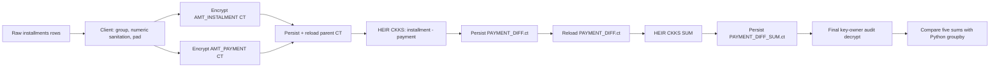

# Five-group `PAYMENT_DIFF` ciphertext DAG

## Scope

This is the small, stable end-to-end proof for the original expression:

```python
ins["PAYMENT_DIFF"] = ins["AMT_INSTALMENT"] - ins["AMT_PAYMENT"]
```

It chooses five complete real `SK_ID_CURR` groups, client-pads each group to a
fixed block, and produces one encrypted `PAYMENT_DIFF` sum per opaque group.
It deliberately excludes `PAYMENT_PERC`, variance, min/max, and FHEW. Those
paths consume substantially more CKKS depth/RAM or require scheme switching.

## Ciphertext flow



There is no decrypt/re-encrypt transition between parent encryption and the
final audit. The audit is after all group paths complete and is never used as
input to an HE operation.

## Runtime output

```text
benchmark_runs/payment_diff_five_group_dag/
  ciphertexts/
    parents/                  # encrypted AMT_INSTALMENT and AMT_PAYMENT
    payment_diff/             # encrypted derived feature
    payment_diff_sum/         # encrypted final group aggregate
  ciphertext_manifest.json    # paths, hashes, sizes, roles
  heir_results.csv            # final audit values and stage timing
  audited_results.csv         # Python vs final decrypted sum
  REPORT.md
```

The ciphertext files are retained from a single shared live CKKS session. A
future separate process may consume them only after a controlled public
context/evaluation-key handoff; it must never receive the secret key.

## Commands

Prepare five real complete groups:

```bash
python3 code/heir/scripts/prepare_payment_diff_groupby_test_data.py \
  --input-csv data/home_credit/installments_payments.csv \
  --output-dir data/prepared/payment_diff_groupby_fixture_5 \
  --group-count 5 \
  --bucket-size 128 \
  --vector-size 8192 \
  --selection largest-fitting \
  --overwrite
```

Generate only the two required HEIR CKKS kernels:

```bash
python3 code/heir/scripts/generate_ckks_baseline_kernels.py \
  --output-dir benchmark_runs/ckks_payment_diff_grouped_8192 \
  --profile all \
  --entries encrypted_subtract encrypted_sum \
  --slot-count 8192 \
  --ciphertext-degree 16384 \
  --lower \
  --overwrite
```

Run exactly one end-to-end DAG pass:

```bash
python3 code/heir/scripts/run_grouped_payment_diff_sum_benchmark.py \
  --generated-dir benchmark_runs/ckks_payment_diff_grouped_8192 \
  --prepared-dir data/prepared/payment_diff_groupby_fixture_5 \
  --output-dir benchmark_runs/payment_diff_five_group_dag \
  --repetitions 1 \
  --report-group-limit 5 \
  --relative-tolerance 1e-6 \
  --openfhe-dir /usr/local/lib/OpenFHE \
  --overwrite
```
