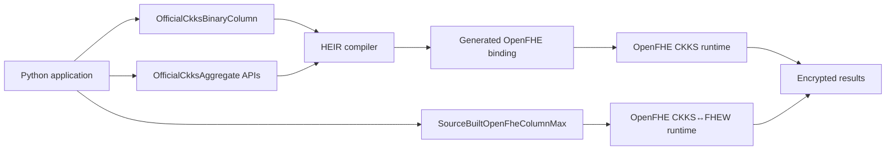

# Các API thực sự tham gia tính toán HE

Tài liệu này phân biệt:

- API thực hiện phép tính trên ciphertext;
- API thuộc vòng đời HE như setup, encrypt và decrypt;
- API chỉ chuẩn bị dữ liệu, lưu checkpoint hoặc tạo báo cáo.

## 1. Phép toán theo cột bằng HEIR/CKKS

| API | Chức năng |
|---|---|
| `OfficialCkksBinaryColumn` | Chương trình HEIR dùng cho CT+CT, CT−CT hoặc CT×CT |
| `OfficialCkksBinaryColumn.eval()` | Thực thi phép toán đã biên dịch trên ciphertext |
| `compile_checkpointable_binary_column()` | Biên dịch phép toán cột và bổ sung khả năng checkpoint |
| `EncryptedDataset.evaluate()` | Facade gọi phép toán HE trên hai ciphertext đã lưu |

Ví dụ tính `PAYMENT_DIFF`:

```python
payment_diff_ct = dataset.evaluate(
    "AMT_INSTALMENT",
    "AMT_PAYMENT",
)
```

Phép tính tương ứng trong OpenFHE:

```text
EvalSub(AMT_INSTALMENT.ct, AMT_PAYMENT.ct)
```

Kết quả `payment_diff_ct` vẫn là ciphertext.

## 2. SUM, MEAN và VARIANCE bằng HEIR/CKKS

| API | Chức năng |
|---|---|
| `OfficialCkksAggregate` | Aggregate một encrypted column |
| `compile_sum()` | Biên dịch SUM |
| `compile_mean()` | Biên dịch MEAN |
| `compile_variance()` | Biên dịch sample variance |
| `compile_checkpointable_sum()` | Biên dịch SUM có hỗ trợ checkpoint |
| `OfficialCkksBinaryColumnAggregate` | Thực hiện binary operation rồi aggregate |
| `compile_checkpointable_binary_column_aggregate()` | Biên dịch một branch SUM, MEAN hoặc VAR |
| `OfficialCkksBinaryColumnStatistics` | Thực hiện binary operation rồi trả SUM/MEAN/VAR |
| `compile_checkpointable_binary_column_statistics()` | Biên dịch combined statistics circuit |

Full `PAYMENT_DIFF` benchmark hiện chủ yếu dùng các branch riêng:

```python
branch = compile_checkpointable_binary_column_aggregate(
    operation="subtract",
    aggregate="sum",  # hoặc "mean", "variance"
    width=width,
    valid_count=valid_count,
    input_scale=input_scale,
)
```

Luồng tính toán:

```text
AMT_INSTALMENT.ct − AMT_PAYMENT.ct
                 │
                 ▼
           PAYMENT_DIFF.ct
                 │
                 ▼
          SUM / MEAN / VAR
```

Các branch riêng hiện đáng tin cậy hơn combined statistics circuit trên server
có tài nguyên hạn chế.

## 3. MIN/MAX bằng OpenFHE

| API | Chức năng |
|---|---|
| `OfficialOpenFheMinMax` | MIN/MAX bằng CKKS↔FHEW |
| `OfficialOpenFheMinMax.eval_min()` | Tính encrypted MIN |
| `OfficialOpenFheMinMax.eval_max()` | Tính encrypted MAX |
| `OfficialOpenFheColumnOps` | Arithmetic và MIN/MAX trong một OpenFHE context |
| `SourceBuiltOpenFheColumnMax` | MAX qua OpenFHE C++ được build trực tiếp trên server |

Server hiện tại dùng:

```python
SourceBuiltOpenFheColumnMax
```

Nguyên nhân là package Python `openfhe` không tương thích với bản OpenFHE
development đang được build và cài trên server. Vì vậy MAX được điều phối từ
Python nhưng thực thi trong source-built C++ runner.

## 4. API thuộc vòng đời HE

Những API này tham gia vòng đời HE nhưng không phải tất cả đều là phép tính
feature.

| API | Chức năng |
|---|---|
| `OfficialCkksBinaryColumn.setup()` | Tạo context và key material |
| `OfficialCkksBinaryColumn.encrypt()` | Mã hóa các cột đầu vào |
| `OfficialCkksBinaryColumn.eval()` | Thực hiện phép tính ciphertext |
| `OfficialCkksBinaryColumn.decrypt()` | Giải mã tại client/audit boundary |
| `OfficialCkksAggregate.encrypt()` | Mã hóa aggregate input |
| `OfficialCkksAggregate.eval()` | Thực hiện aggregate HE |
| `OfficialCkksAggregate.decrypt()` | Giải mã aggregate cuối |
| `EncryptedDataset.encrypt()` | Compile, setup, pack và mã hóa hai cột |
| `EncryptedDataset.evaluate()` | Thực hiện binary operation trên ciphertext |
| `EncryptedDataset.decrypt_result()` | Giải mã kết quả cuối tại client |

## 5. API không thực hiện phép tính HE

| API | Chức năng thực tế |
|---|---|
| `prepare_allowed_group_csv()` | Chọn, làm sạch và padding group tại client |
| `load_prepared_allowed_group()` | Đọc group đã chuẩn bị |
| `prepare_post_psi_groups()` | Chọn và sắp xếp group sau PSI |
| `EncryptedDataset.save()` | Serialize context, key và ciphertext |
| `EncryptedDataset.load()` | Deserialize context, key và ciphertext |
| `save_binary_column_aggregate_checkpoint()` | Lưu aggregate checkpoint |
| `load_binary_column_aggregate_checkpoint()` | Khôi phục aggregate checkpoint |
| `_run_multiple_allowed_groups()` | Điều phối nhiều benchmark process |
| `_multi_report()` | Tổng hợp kết quả và tạo report |

`EncryptedDataset.save()` và `EncryptedDataset.load()` thuộc hạ tầng lưu trữ
trạng thái mã hóa. Chúng không tạo ra phép tính feature mới.

## 6. Danh sách lõi tính toán HE

Các implementation chính thực sự thực hiện phép tính HE là:

```text
OfficialCkksBinaryColumn
OfficialCkksAggregate
OfficialCkksBinaryColumnAggregate
OfficialCkksBinaryColumnStatistics
OfficialOpenFheMinMax
OfficialOpenFheColumnOps
SourceBuiltOpenFheColumnMax
```

Quan hệ tổng quát:



## 7. Trạng thái kết nối hiện tại

`EncryptedDataset` đã có thể:

```text
encrypt parent columns
→ save
→ load trong process mới
→ CT−CT
→ PAYMENT_DIFF.ct
→ final audit decrypt
```

Tuy nhiên, `PAYMENT_DIFF.ct` từ `EncryptedDataset.evaluate()` chưa được truyền
trực tiếp vào các API SUM/MEAN/VAR/MAX hiện tại. Full benchmark vẫn tạo các
branch riêng, mỗi branch nhận hai parent column rồi tự thực hiện subtraction
trước khi aggregate.

Adapter ciphertext chung giữa `EncryptedDataset` và các aggregate API là phần
kết nối còn thiếu nếu muốn toàn bộ pipeline dùng một ciphertext nguồn duy
nhất.

## 8. API ciphertext-in/ciphertext-out đơn giản

`CkksSession` cung cấp API nhỏ, giữ tất cả phép tính trong cùng một OpenFHE
context:

```python
from code.heir.python_api import CkksSession

he = CkksSession.create(
    width=4,
    input_scale=4096.0,
    ring_dimension=16384,
)

left_ct = he.encrypt_column(left)
right_ct = he.encrypt_column(right)

derived_ct = he.subtract(left_ct, right_ct)

sum_ct = he.sum(derived_ct)
mean_ct = he.mean(derived_ct)
variance_ct = he.variance(derived_ct)
minimum_ct = he.minimum(derived_ct)
maximum_ct = he.maximum(derived_ct)
```

API public:

```text
he.add(left_ct, right_ct)       -> EncryptedColumn
he.subtract(left_ct, right_ct)  -> EncryptedColumn
he.multiply(left_ct, right_ct)  -> EncryptedColumn

he.sum(column_ct)               -> EncryptedScalar
he.mean(column_ct)              -> EncryptedScalar
he.variance(column_ct)          -> EncryptedScalar
he.minimum(column_ct)           -> EncryptedScalar
he.maximum(column_ct)           -> EncryptedScalar
```

`EncryptedColumn` lưu reference đến session, public `valid_count` và scale.
Ciphertext từ hai session khác nhau bị từ chối trước khi gọi OpenFHE.

SUM, MEAN và VAR dùng public validity mask để loại padding. MIN/MAX dùng
duplicate padding nên padding không thay đổi extrema.

Implementation này sử dụng direct OpenFHE Python wrapper để giữ tất cả phép
tính trong cùng một context. Bản OpenFHE development trên server hiện chưa có
Python wrapper tương thích; source-built C++ MAX route vẫn là backend đang dùng
trong full benchmark cho tới khi binding đó được build.

Ví dụ đầy đủ:

```bash
python3 code/heir/examples/simple_ciphertext_api.py
```
