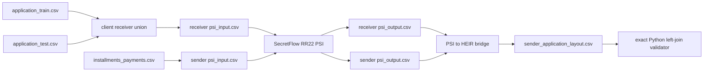

# Installments PSI join runbook

## Purpose

This is the private identifier-alignment step for the original notebook's
join:

```python
df = df.join(ins_agg, how="left", on="SK_ID_CURR")
```

It matches the application receiver set to the applicants present in
`installments_payments.csv`. PSI runs **before** CKKS/HEIR. It is not an HE
calculation and it has no approximate numerical accuracy.

## Parties and exact scope

| PSI role | Input | Why |
|---|---|---|
| Receiver | `application_train ∪ application_test` keys | The notebook concatenates train and test before joining features. |
| Sender | Unique `SK_ID_CURR` keys from `installments_payments.csv` | This run validates the installments join only. |
| Excluded | `TARGET`, numeric feature columns, duplicated installment rows | They are not PSI identifiers. |

Do not reuse a `home_credit_history_union` PSI result here: it represents a
different sender universe and cannot validate the specific installments join.

## Artifact flow



## Required order

1. Build the client-only receiver union. Test rows receive a blank `TARGET`.
2. Prepare identifier-only PSI files for receiver and sender.
3. Run SecretFlow PSI. Its two party outputs must be aligned and ordered.
4. Run the bridge. It makes a dense receiver-left layout whose unmatched sender
   positions are blank.
5. Run the validator against the original CSV relationship.

The bridge is required. Raw `data/psi/*/psi_output.csv` files alone are not an
HEIR layout and cannot be passed to the validator.

## Expected private runtime outputs

```text
data/prepared/psi/application_train_test_union.csv
data/psi/receiver/psi_input.csv
data/psi/sender/psi_input.csv
data/psi/receiver/psi_output.csv
data/psi/sender/psi_output.csv
benchmark_runs/psi/installments_application/rr22_train_test_01/
  client_private/receiver_application_layout.csv
  private_exchange/sender_application_layout.csv
  alignment_manifest.json
  psi_bridge_report.md
benchmark_runs/psi_validation/installments_left_join_rr22_train_test_01/
  result.json
  REPORT.md
```

All are ignored runtime artifacts. Do not commit them because they contain raw
identifiers or their private mapping.

## Acceptance

The final `REPORT.md` must show:

| Check | Required result |
|---|---|
| False positives | `0` |
| False negatives | `0` |
| Precision | `1.0` |
| Recall | `1.0` |
| Sender slots | Same count as the train/test receiver union |
| Unmatched applicants | Blank sender slots, preserving receiver-left semantics |
| TARGET in sender exchange | Absent |

This is an exact membership check. It is not a runtime comparison with Pandas
and it does not encrypt, decrypt, or benchmark CKKS arithmetic.
