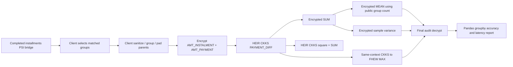

# Post-PSI `PAYMENT_DIFF` end-to-end proof

This is the small complete version of one original feature family, not a
primitive operation benchmark.

```python
ins["PAYMENT_DIFF"] = ins["AMT_INSTALMENT"] - ins["AMT_PAYMENT"]

ins.groupby("SK_ID_CURR")["PAYMENT_DIFF"].agg(
    ["max", "mean", "sum", "var"]
)
```

## Scope

The run begins **after PSI**. It reads matched applicant keys from the private
installments PSI bridge, selects two or five complete groups, then builds the
same fixed-block group layout used by the HE evaluation.



`PAYMENT_DIFF_MAX` uses a different padding representation from SUM/MEAN/VAR:
non-real lanes repeat one genuine encrypted parent pair. Repetition cannot
change a maximum, including when all real differences are negative. SUM and
variance use zero padded lanes instead. Both derived feature branches are
calculated after encryption from the same real parent values.

## No intermediate decrypt

There is no decrypt/re-encrypt boundary between parent encryption and the
final aggregate audit. The run uses one live CKKS context with FHEW switching
enabled. The final key-owner audit decrypts only:

- `PAYMENT_DIFF_MAX`
- `PAYMENT_DIFF_MEAN`
- `PAYMENT_DIFF_SUM`
- `PAYMENT_DIFF_VAR` (sample variance, `ddof=1`)

The group count is public metadata in this small proof, allowing
`MEAN = encrypted SUM × public(1/count)`. An encrypted count/reciprocal path
is deliberately not hidden here because it is a separate depth-heavy design.

## Run two groups first

The integrated CKKS↔FHEW maximum route needs a larger ring and multiplicative
depth than the CKKS-only benchmarks. Start with two groups.

```bash
python3 code/heir/scripts/run_payment_diff_groupby_e2e.py \
  --bridge-dir benchmark_runs/psi/installments_application/rr22_train_test_01 \
  --installments data/home_credit/installments_payments.csv \
  --output-dir benchmark_runs/payment_diff_post_psi_e2e_2groups \
  --group-count 2 \
  --bucket-size 128 \
  --ciphertext-degree 65536 \
  --ckks-mul-depth 20 \
  --relative-tolerance 1e-5 \
  --openfhe-dir /usr/local/lib/OpenFHE \
  --overwrite
```

Use `--group-count 5` only after the two-group report passes. The resulting
`REPORT.md` has the accuracy of every aggregate for every opaque group and the
full post-PSI latency breakdown. A failed MAX or VAR row is reported as a
failure; it is never substituted with a plaintext value.
