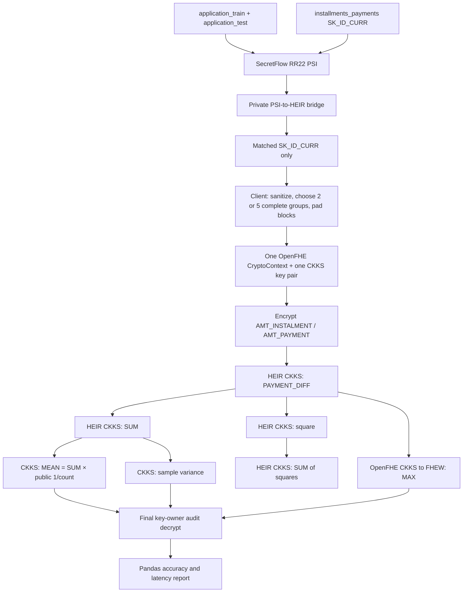

# Post-PSI `PAYMENT_DIFF` end-to-end flow

## What this proves

This document describes the complete small-scale encrypted implementation of
one feature family from `installments_payments()`:

```python
ins["PAYMENT_DIFF"] = ins["AMT_INSTALMENT"] - ins["AMT_PAYMENT"]

ins.groupby("SK_ID_CURR")["PAYMENT_DIFF"].agg(
    ["max", "mean", "sum", "var"]
)
```

For a selected set of two or five applicants, the result is one encrypted set
of these aggregates per opaque group:

```text
PAYMENT_DIFF_MAX
PAYMENT_DIFF_MEAN
PAYMENT_DIFF_SUM
PAYMENT_DIFF_VAR       # sample variance: pandas ddof=1
```

This is an HE feasibility/accuracy proof. It is not the whole Home Credit
pipeline, a LightGBM evaluation, or a production PSI deployment.

## End-to-end boundary

PSI itself is completed before this workload starts. The runner consumes the
private PSI bridge, then measures the full encrypted feature workload.



There is no decryption followed by re-encryption anywhere between `P` and
`F`. The final audit values are never used as input to another HE operation.

## PSI prerequisite

The bridge must be for this exact join, not the all-history-table union:

| Role | Required data |
|---|---|
| Receiver PSI input | `application_train ∪ application_test` keys |
| Sender PSI input | unique `SK_ID_CURR` from `installments_payments.csv` only |
| Required bridge layout | `private_exchange/sender_application_layout.csv` |

The runner reads matched keys from the private sender layout. It refuses to
fall back to unjoined raw groups because that would no longer be a post-PSI
proof.

## Client preparation after PSI

The client performs the following before HE encryption:

1. Read only installment rows whose `SK_ID_CURR` occurs in the private PSI
   sender layout.
2. Drop rows with a missing/non-finite `AMT_PAYMENT` or `AMT_INSTALMENT`.
3. Select complete groups with `2 <= row_count <= bucket_size`.
4. Assign each selected applicant an opaque group ordinal (`0`, `1`, ...).
5. Write numeric parent-column blocks and a `validity_mask`.
6. Keep `SK_ID_CURR ↔ opaque_group_id` and the Pandas reference in
   `client_private/`; they are not HE evaluator input.

The HE-ready block contains only:

```text
opaque_group_id, lane, AMT_PAYMENT, AMT_INSTALMENT, validity_mask
```

`PAYMENT_DIFF` is deliberately absent. It must be derived after encryption.

## Padding rules

Each selected applicant has a fixed 128-lane block by default.

| Branch | Padding representation | Reason |
|---|---|---|
| SUM, MEAN, VAR | Parent values are zero | Zero does not alter sums or moments. |
| MAX | Non-real lanes repeat one genuine encrypted parent pair | Repetition cannot alter a maximum, even if all real differences are negative. |

Both branches calculate `AMT_INSTALMENT - AMT_PAYMENT` *after encryption*.
The two padding representations are not two business datasets; they are two
correct encrypted reduction encodings of the same real rows.

## One-context key contract

The complete run uses one `CryptoContext` and one CKKS key pair.

| Item | Created once? | Purpose |
|---|---|---|
| CKKS public key | Yes | Encrypt every parent-column block. |
| CKKS secret key | Yes, client/key owner only | Final audit decrypt. Never sent to evaluator. |
| HEIR multiplication keys | Yes | Square and variance multiplication. |
| HEIR rotation/sum keys | Yes | Encrypted SUM reductions. |
| CKKS↔FHEW switching keys | Yes | Use encrypted `PAYMENT_DIFF` for MAX. |
| MAX comparison-tree keys | Yes | Generated by `SetComputeArgmin(true)`. Encrypted argmax is discarded. |

These are evaluation keys for the same context/key pair—not a fresh key pair
or a fresh encryption per feature. `PAYMENT_DIFF_MAX` consumes a derived
ciphertext from the same live context.

## Encrypted calculation detail

Let `x = AMT_INSTALMENT - AMT_PAYMENT`, represented in CKKS as `x / scale`.
The scale is a public power of two large enough to keep the MAX comparison
input in the CKKS↔FHEW unit interval.

| Output | Encrypted computation | Restored audit unit |
|---|---|---|
| SUM | `Σ(x / scale)` | multiply decrypted result by `scale` |
| MEAN | `SUM × public(1 / n)` | multiply by `scale` |
| VAR | `(Σ(x/scale)^2 - SUM × MEAN) / (n - 1)` | multiply by `scale²` |
| MAX | same-context CKKS→FHEW comparison tree over `x / scale` | multiply by `scale` |

`n` is the group row count. In this proof it is public group metadata. An
encrypted count plus encrypted reciprocal would be a separate, deeper
benchmark and is not hidden inside this implementation.

## Multiplicative depth and parameters

The default integrated run uses:

```text
bucket size:          128
ciphertext degree:    65536
CKKS multiplicative depth: 20
threads:              1
```

Depth 20 is shared by every group in the one context. It covers the CKKS
square/variance route and the CKKS↔FHEW MAX setup for 128 candidates. Groups
are evaluated sequentially, so five groups increase runtime but do not add
multiplicative depth to an individual ciphertext path.

There is no bootstrapping in this proof. If OpenFHE reports insufficient
depth, parameter generation failure, or memory exhaustion, record it as a
deployment limit; do not decrypt an intermediate value to work around it.

## Final audit and fair Python comparison

Only after all group branches finish, the key owner decrypts final MAX, MEAN,
SUM, and VAR values. The runner compares them with this exact Pandas workload
over the same selected post-PSI real rows:

```python
real["PAYMENT_DIFF"] = real["AMT_INSTALMENT"] - real["AMT_PAYMENT"]
real.groupby("opaque_group_id")["PAYMENT_DIFF"].agg(
    ["max", "mean", "sum", "var"]
)
```

The direct performance comparison excludes CSV read and client layout from
both sides. The report still displays client post-PSI layout time separately,
because scanning the raw installments file is a real pipeline cost.

## Latency definitions in `REPORT.md`

| Measure | Includes |
|---|---|
| Client post-PSI layout | Raw-row scan, sanitation, complete-group selection, opaque layout/padding. |
| Shared one-context setup | Context/key generation, HEIR configuration, CKKS↔FHEW switching/comparison keys. |
| HE online | Parent encryption through final encrypted MAX/MEAN/SUM/VAR, summed across groups; no audit decrypt. |
| Final audit decrypt | Only final aggregate ciphertext decryptions. |
| Pandas total | `PAYMENT_DIFF` expression plus same-group `max/mean/sum/var`. |

## Runtime artifacts

```text
benchmark_runs/payment_diff_post_psi_e2e_<2|5>groups/
  client_private/
    group_mapping.csv                 # raw key mapping; do not share
    pandas_groupby_reference.csv      # audit only; do not share
  he_ready/
    group_blocks.csv                  # opaque numeric parent input
  generated/                          # HEIR MLIR/lowered/OpenFHE sources
  runner/
    runner.log
  preparation.json
  he_results.csv
  execution.json
  REPORT.md
  result.json
```

`REPORT.md` is the review artifact. It shows every aggregate for every opaque
group, absolute error, PASS/FAIL, full all-group HE timing, and equivalent
Pandas timing.

## Known limits and honest interpretation

- MAX is approximate because CKKS↔FHEW switching is approximate at the CKKS
  boundary. Do not loosen the configured tolerance merely to make it pass.
- MAX is expected to dominate runtime; this is the cost of private comparison,
  not a general CKKS subtraction cost.
- The proof uses small complete groups and a public count. It does not yet
  implement arbitrary oversized-group merging or hidden counts.
- `PAYMENT_PERC`, DPD/DBD clipping, min, categorical means, `nunique`, and
  LightGBM scoring are intentionally outside this single-feature proof.
- A PASS means these selected groups passed the stated tolerance on this
  context and parameter set. It does not establish full-dataset scalability.

## Commands

Run two groups first:

```bash
python3 code/heir/scripts/run_payment_diff_groupby_e2e.py \
  --bridge-dir benchmark_runs/psi/installments_application/rr22_train_test_01 \
  --installments data/home_credit/installments_payments.csv \
  --output-dir benchmark_runs/payment_diff_post_psi_e2e_2groups \
  --group-count 2 \
  --bucket-size 128 \
  --ciphertext-degree 65536 \
  --ckks-mul-depth 20 \
  --relative-tolerance 1e-5 \
  --openfhe-dir /usr/local/lib/OpenFHE \
  --overwrite
```

After a passing two-group audit, change only these values for five groups:

```text
--output-dir benchmark_runs/payment_diff_post_psi_e2e_5groups
--group-count 5
```
