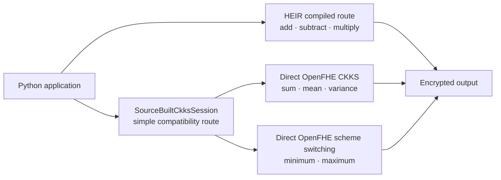

# Simple HE Python API

This document separates:

1. calculations HEIR already expresses naturally from Python/MLIR; and
2. high-level column operations supplied by our simple API through OpenFHE.

## 1. Operations HEIR already supports

HEIR already supports ordinary arithmetic expressions. We do not need to
invent cryptographic implementations for them.

| Python calculation | Encrypted form | HEIR support |
|---|---|---|
| `left + right` | CT + CT | Native arithmetic |
| `left - right` | CT − CT | Native arithmetic |
| `left * right` | CT × CT | Native arithmetic |

For example, the business expression:

```python
ins["PAYMENT_DIFF"] = (
    ins["AMT_INSTALMENT"] - ins["AMT_PAYMENT"]
)
```

becomes:

```python
payment_diff_ct = he.subtract(
    installment_ct,
    payment_ct,
)
```

The method takes two encrypted columns from the same context and returns a new
encrypted column. It does not take plaintext parent columns.

The public simple API names are:

```python
he.add(left_ct, right_ct)
he.subtract(left_ct, right_ct)
he.multiply(left_ct, right_ct)
```

The current server facade executes these operations with the corresponding
OpenFHE runtime calls:

```text
add       → EvalAdd(left_ct, right_ct)
subtract  → EvalSub(left_ct, right_ct)
multiply  → EvalMult(left_ct, right_ct)
```

This is a deployment choice. The calculations themselves are already within
HEIR's normal arithmetic capability.

## 2. Operations supplied by our simple API

HEIR can compile explicit reduction circuits, and this repository has separate
HEIR SUM/MEAN/VAR programs. However, the current HEIR Python ciphertext object
does not provide one simple reusable interface such as `ct.sum()` or
`ct.maximum()` that can consume any existing ciphertext in one shared session.

Our source-built simple API therefore exposes these high-level methods directly
through OpenFHE:

| Simple API | Direct backend operation | Output |
|---|---|---|
| `he.sum(column_ct)` | CKKS rotations and additions with `EvalSum` | Encrypted scalar |
| `he.mean(column_ct)` | Encrypted SUM × public `1 / count` | Encrypted scalar |
| `he.variance(column_ct)` | Encrypted SUM and square-sum formula | Encrypted scalar |
| `he.minimum(column_ct)` | CKKS→FHEW MIN→CKKS | Encrypted scalar |
| `he.maximum(column_ct)` | CKKS→FHEW MAX→CKKS | Encrypted scalar |

Important distinction:

- SUM, MEAN, and VARIANCE are mathematically possible in HEIR.
- The simple server API uses direct OpenFHE so the same loaded ciphertext can
  be passed to all three methods.
- MIN and MAX require OpenFHE CKKS↔FHEW scheme switching; they are not ordinary
  CKKS arithmetic expressions.

MEAN uses the public valid row count. VARIANCE is fixed to sample variance,
equivalent to Pandas `var(ddof=1)`. MIN/MAX return only the encrypted values;
argmin and argmax are not retained.

## 3. Simple server API

Use this backend on the current server:

```python
from code.heir.python_api import SourceBuiltCkksSession
```

Create a context and checkpoint:

```python
he = SourceBuiltCkksSession.create(
    checkpoint_dir=Path("encrypted_session"),
    width=128,
    input_scale=524288.0,
    ring_dimension=16384,
    openfhe_dir="/usr/local/lib/OpenFHE",
)
```

Encrypt two parent columns:

```python
installment_ct = he.encrypt_column(
    installment_values,
    name="AMT_INSTALMENT",
)
payment_ct = he.encrypt_column(
    payment_values,
    name="AMT_PAYMENT",
)
```

Reload them in another process:

```python
he = SourceBuiltCkksSession.load(
    Path("encrypted_session")
)
installment_ct = he.load_column("AMT_INSTALMENT")
payment_ct = he.load_column("AMT_PAYMENT")
```

Calculate without intermediate decryption:

```python
added_ct = he.add(installment_ct, payment_ct)
payment_diff_ct = he.subtract(installment_ct, payment_ct)
multiplied_ct = he.multiply(installment_ct, payment_ct)

sum_ct = he.sum(payment_diff_ct)
mean_ct = he.mean(payment_diff_ct)
variance_ct = he.variance(payment_diff_ct)
minimum_ct = he.minimum(payment_diff_ct)
maximum_ct = he.maximum(payment_diff_ct)
```

Decrypt only at the output boundary:

```python
payment_diff = he.decrypt_column(payment_diff_ct)
total = he.decrypt_scalar(sum_ct)
mean = he.decrypt_scalar(mean_ct)
variance = he.decrypt_scalar(variance_ct)
minimum = he.decrypt_scalar(minimum_ct)
maximum = he.decrypt_scalar(maximum_ct)
```

## 4. Input and output contract

| Method | Takes | Returns | Does not take |
|---|---|---|---|
| `create` | Width, scale, ring dimension, OpenFHE directory | New file-backed session | DataFrame |
| `load` | Existing compatible checkpoint | Reloaded session | Parent plaintext |
| `encrypt_column` | Finite numeric sequence and name | Encrypted column | Null/string/categorical data |
| `load_column` | Registered parent name | Encrypted column handle | Arbitrary foreign ciphertext |
| `add/subtract/multiply` | Two compatible encrypted columns | Encrypted column | Raw Python lists |
| `sum/mean/variance` | One encrypted column | Encrypted scalar | Group identifier |
| `minimum/maximum` | One encrypted column within the declared range | Encrypted scalar | Argmin/argmax request |
| `decrypt_column` | Compatible encrypted column | Tuple of numbers | Foreign-session ciphertext |
| `decrypt_scalar` | Compatible encrypted scalar | One number | Encrypted column vector |

Compatibility requirements:

- Both operands must belong to the same CKKS context.
- Both operands must contain the same public number of valid rows.
- ADD and SUBTRACT require the same public scale.
- The real row count must not exceed the configured width.
- Numeric null handling must happen before encryption.
- The public validity count excludes padding from SUM/MEAN/VARIANCE.

## 5. What this API does not do

The simple API is not encrypted Pandas. It does not currently provide:

- `EncryptedDataFrame` or `df["column"]` syntax;
- general `groupby`;
- joins or PSI;
- null handling after encryption;
- division as a general method;
- categorical encoding or `nunique`;
- arbitrary filters and comparisons;
- automatic depth, scale, or bootstrapping planning;
- LightGBM inference.

Client code must prepare numeric, aligned columns before calling
`encrypt_column()`.

## 6. Backend boundary



The diagram describes capability ownership. In the current source-built server
facade, all three branches are executed by its OpenFHE C++ runner. HEIR-native
arithmetic remains available through the separate compiled HEIR APIs.

## 7. Runnable example

```bash
python3 code/heir/examples/payment_diff_simple_api_e2e.py \
  --stage roundtrip \
  --installments data/home_credit/installments_payments.csv \
  --allowed-sk-id-curr 100001 \
  --ring-dimension 16384 \
  --openfhe-dir /usr/local/lib/OpenFHE \
  --output-dir benchmark_runs/payment_diff_simple_api_100001 \
  --overwrite
```

This example contains no Pandas/plaintext reference and no benchmark timing.
It demonstrates encryption, checkpoint reload, CT+CT, CT−CT, CT×CT,
SUM/MEAN/VAR/MIN/MAX, and final decryption.

## 8. Development qualification

The current source-built route is for functionality testing:

- CKKS uses `HEStd_NotSet`;
- FHEW MIN/MAX currently uses the `TOY` setting;
- the trial checkpoint contains a client audit secret.

It is not yet a production 128-bit security claim.
