# Home Credit LightGBM Notebook: Pipeline Decomposition and HE/HEIR Applicability

## 1. Notebook Overview

Source notebook:

- Kaggle: <https://www.kaggle.com/code/jsaguiar/lightgbm-with-simple-features>
- Local source file: `lightgbm_with_simple_features.py`

The notebook is primarily a **feature-engineering and LightGBM credit-default-risk pipeline**.

Its main workflow is:

```text
Data ingestion
    -> Data cleaning and encoding
    -> Customer-level feature engineering
    -> Aggregation of historical tables
    -> Data integration
    -> LightGBM training with KFold
    -> ROC-AUC evaluation
    -> Feature-importance analysis
    -> Test-set risk prediction
```

It is not a complete exploratory data analysis or model-selection notebook because:

- Exploratory analysis is almost absent.
- Feature selection is limited.
- Only one model family, LightGBM, is trained.
- LightGBM hyperparameters are predefined rather than systematically compared.
- KFold is used to validate the selected model, not to select among different model families.

---

## 2. Is This a Credit-Rating Model?

The notebook implements a **credit default-risk scoring model**.

The target variable is defined as:

- `TARGET = 1`: the applicant experiences payment difficulty and represents higher default risk.
- `TARGET = 0`: the applicant does not experience payment difficulty.

The model outputs a probability-like score used to rank applicants by repayment risk.

It is therefore more accurately described as:

> An applicant-level credit default-risk or probability-of-default-like scoring model.

It is not a formal credit-rating system that assigns grades such as AAA, AA, A or BBB.

---

## 3. Data Science Task Decomposition

| Task | Notebook component | Main purpose |
|---|---|---|
| 1. Data ingestion | `application_train_test()` and table-specific functions | Read application, bureau, previous-loan, POS, installment and credit-card data |
| 2. Data cleaning | Sentinel replacement and row filtering | Convert abnormal values such as `365243` to missing values and remove invalid categories |
| 3. Categorical encoding | `one_hot_encoder()` and `factorize()` | Convert categorical values into numeric representations |
| 4. Application-level feature engineering | `application_train_test()` | Create ratios related to income, credit, annuity, family size and employment |
| 5. Bureau feature engineering | `bureau_and_balance()` | Aggregate external credit-history information by applicant |
| 6. Previous-application feature engineering | `previous_applications()` | Aggregate approved, refused and general previous-loan information |
| 7. POS feature engineering | `pos_cash()` | Aggregate POS cash-loan balance and delinquency information |
| 8. Installment feature engineering | `installments_payments()` | Create payment difference, payment ratio, days-past-due and days-before-due features |
| 9. Credit-card feature engineering | `credit_card_balance()` | Aggregate credit-card balance and transaction-history features |
| 10. Segmented aggregation | Active/closed and approved/refused subsets | Produce separate statistics for important business subgroups |
| 11. Data integration | `df.join(..., on='SK_ID_CURR')` | Combine all customer-level feature tables |
| 12. Train/test preparation | `kfold_lightgbm()` | Separate labeled training rows from unlabeled test rows |
| 13. Model training | `LGBMClassifier` | Train one predefined LightGBM classifier |
| 14. Model validation | KFold and ROC-AUC | Measure out-of-fold discrimination performance |
| 15. Feature analysis | `display_importances()` | Rank and visualize important features |
| 16. Prediction | `predict_proba()` | Produce default-risk scores for test applicants |

The notebook is dominated by **feature engineering**. Most features are produced by aggregating historical records using:

- `count`
- `size`
- `sum`
- `mean`
- `min`
- `max`
- `variance`
- category proportions

---

## 4. Missing Stages in a Complete Data Science Workflow

### 4.1 Exploratory Data Analysis

A more complete workflow should include:

- Target-class distribution.
- Missing-value rate by variable.
- Numerical feature distributions.
- Categorical frequency distributions.
- Default rate by customer group.
- Correlation analysis.
- Outlier and anomaly analysis.
- Data-leakage checks.

### 4.2 Feature Selection

The notebook performs little explicit feature selection. Additional tasks may include:

- Removing constant and near-constant features.
- Removing duplicated features.
- Removing highly correlated or redundant features.
- Evaluating feature-importance stability across folds.
- Permutation importance or SHAP-based assessment.
- Business-validity and leakage review.

### 4.3 Model Selection

The notebook validates one LightGBM configuration but does not compare multiple modeling approaches.

A model-selection stage could compare:

- Logistic regression.
- Linear scorecard.
- LightGBM.
- XGBoost.
- CatBoost.
- Small neural network.

Possible comparison criteria include:

- ROC-AUC.
- Precision-recall AUC.
- Calibration.
- Recall at a selected risk threshold.
- Runtime.
- Interpretability.
- HE deployment feasibility.

---

## 5. HE/HEIR Applicability by Notebook Component

HEIR should be treated as a compiler for fixed numerical computations over encrypted data, not as an encrypted replacement for pandas.

| Notebook operation | HEIR suitability | Recommended approach |
|---|---:|---|
| CSV reading | Not suitable | Read data before encryption |
| Arbitrary missing-value detection | Client only; no HEIR workload | Clean/impute locally and optionally include a prepared missing-indicator feature |
| Sentinel replacement | Client only; no HEIR workload | Replace abnormal values before encryption |
| String factorization | Client only; no HEIR workload | Convert categories into numerical representations before encryption |
| One-hot encoding | Client only; no HEIR workload | Trusted client supplies numeric one-hot vectors or category masks |
| Addition and subtraction | High | Direct encrypted arithmetic |
| Multiplication | High | Ciphertext-ciphertext or ciphertext-plaintext multiplication |
| Ratio features | Client only for V1 | Compute on the trusted client before encrypting the final numeric feature |
| Count | High | Sum encrypted binary masks |
| Sum | High | Packed additions and rotations |
| Mean | High | Compute encrypted sum and count, then divide after authorized decryption |
| Variance | High | Compute count, sum and sum of squares |
| Category count | High | Sum an encoded category mask |
| Category default rate | High | Compute masked count and masked target sum |
| Active/closed aggregation | High with masks | Trusted client provides active and closed masks |
| Approved/refused aggregation | High with masks | Trusted client provides approved and refused masks |
| Minimum and maximum | Excluded V1 | Require comparisons or approximation and will not receive an initial CKKS workload |
| `nunique` | Excluded V1 | Compute before encryption; do not implement as an initial CKKS workload |
| Arbitrary `groupby` | Client only | Establish row grouping before encryption, then run selected fixed arithmetic kernels |
| DataFrame joins | Client only | Join and align rows before encryption |
| KFold splitting | Little HE benefit | Perform outside HE |
| LightGBM training | Not practical | Train in plaintext or a trusted environment |
| LightGBM inference | Possible but complex | Requires encrypted comparisons and oblivious tree traversal |
| ROC-AUC | Poor fit | Sorting and ranking should normally occur after decryption |
| Threshold confusion matrix | Medium to high | Compute encrypted TP, FP, TN and FN if threshold comparison is supported |
| Feature-importance plotting | Not suitable | Produce after model training |

---

## 6. Strong HEIR Candidates

### 6.1 Encrypted Exploratory Data Analysis

The following EDA statistics are strong HE candidates:

- Record count.
- Target count.
- Default rate.
- Sum.
- Mean.
- Variance.
- Sum of squares.
- Category count.
- Default count by category.
- Default rate by category.
- Correlation sufficient statistics.

For a category such as `Higher education`, the trusted client first converts the raw category into a numeric mask:

```python
group_mask = [1, 0, 1, 1, 0, ...]
```

The HE computation then evaluates:

```text
group_count   = SUM(group_mask)
default_count = SUM(group_mask * TARGET)
```

The default rate can be calculated after authorized decryption:

```text
default_rate = default_count / group_count
```

The encrypting/client side must provide the encoded category mask because the HE computation operates on numerical representations rather than raw categorical labels.

---

### 6.2 Encrypted Correlation Statistics

Instead of calculating the final correlation coefficient entirely under HE, the service can compute sufficient statistics:

```text
n
SUM(x)
SUM(y)
SUM(x^2)
SUM(y^2)
SUM(x*y)
```

The final division and square-root operations can be performed after authorized decryption.

This reduces multiplicative depth and avoids expensive encrypted nonlinear operations.

---

### 6.3 Historical Aggregate Features

A large part of the notebook's historical feature engineering can be represented as encrypted aggregation kernels.

Examples include:

```text
SUM(AMT_CREDIT_SUM)
SUM(AMT_CREDIT_SUM_DEBT)
SUM(CNT_CREDIT_PROLONG)
SUM(AMT_PAYMENT)
SUM(PAYMENT_DIFF)
COUNT(records)
MEAN(SK_DPD)
VAR(PAYMENT_PERC)
```

These operations can be implemented using encrypted vectors, rotations and additions.

---

### 6.4 Segmented Aggregation Using Masks

The original notebook separates important subsets such as:

- Active credits.
- Closed credits.
- Approved applications.
- Refused applications.

Under HE, these filters should be represented as numeric masks prepared before encryption.

For active-credit amount:

```text
active_credit_sum = SUM(active_mask * credit_amount)
```

For refused previous applications:

```text
refused_credit_sum = SUM(refused_mask * AMT_CREDIT)
```

For closed debt:

```text
closed_debt_sum = SUM(closed_mask * AMT_CREDIT_SUM_DEBT)
```

This pattern is highly compatible with CKKS and HEIR because it replaces encrypted branching with multiplication by encoded binary masks.

---

### 6.5 Simple Encrypted Feature Engineering

The following features are suitable or partly suitable:

```text
PAYMENT_DIFF = AMT_INSTALMENT - AMT_PAYMENT
DPD_RAW      = DAYS_ENTRY_PAYMENT - DAYS_INSTALMENT
DBD_RAW      = DAYS_INSTALMENT - DAYS_ENTRY_PAYMENT
```

However, clipping negative values to zero requires a comparison:

```python
DPD = max(DPD_RAW, 0)
```

This is not a simple CKKS arithmetic operation. Practical options are:

- Compute clipping before encryption.
- Approximate `max(x, 0)` with a polynomial.
- Use scheme switching or a Boolean HE backend for comparison.

---

## 7. Ratio Features Under HE

The notebook creates several ratio features:

```text
DAYS_EMPLOYED_PERC = DAYS_EMPLOYED / DAYS_BIRTH
INCOME_CREDIT_PERC = AMT_INCOME_TOTAL / AMT_CREDIT
INCOME_PER_PERSON  = AMT_INCOME_TOTAL / CNT_FAM_MEMBERS
ANNUITY_INCOME_PERC = AMT_ANNUITY / AMT_INCOME_TOTAL
PAYMENT_RATE        = AMT_ANNUITY / AMT_CREDIT
APP_CREDIT_PERC     = AMT_APPLICATION / AMT_CREDIT
PAYMENT_PERC        = AMT_PAYMENT / AMT_INSTALMENT
```

Encrypted division is expensive and is not directly supported as a basic HE operation.

Recommended options are:

1. Compute ratios on the trusted client before encryption.
2. Provide an encrypted numerator and plaintext reciprocal denominator when policy allows.
3. Approximate reciprocal using a low-degree polynomial over a bounded input range.
4. Return encrypted numerator and denominator and divide after authorized decryption.

For the first HE prototype, client-side ratio computation or post-decryption division is preferable.

---

## 8. Operations That Should Remain Outside HE

### 8.1 Data Cleaning and Encoding

The following operations should normally be performed on the trusted client:

```python
replace(365243, np.nan)
pd.factorize(...)
pd.get_dummies(...)
df[df['CODE_GENDER'] != 'XNA']
```

Raw strings, arbitrary nulls and pandas object columns should not be sent directly into HE kernels.

The HE service should receive defined numerical structures such as:

```text
value vector
validity mask
category mask
group mask
```

---

### 8.2 DataFrame Joins

Operations such as:

```python
df.join(bureau, on='SK_ID_CURR')
```

are not normal HE arithmetic kernels.

Practical alternatives are:

1. Join and aggregate data at the trusted source before encryption.
2. Use private set intersection for private identifier matching.
3. Construct fixed customer/group masks before encryption.
4. Encrypt only the final customer-level feature matrix.

---

### 8.3 Arbitrary GroupBy

A general pandas operation such as:

```python
df.groupby('SK_ID_CURR').agg(...)
```

requires dynamic grouping by identifiers and is not directly compatible with a fixed HE circuit.

Recommended designs are:

- Pre-group records by applicant before encryption.
- Encrypt one packed vector per customer.
- Use a fixed mask for each known customer group.
- Use PSI or another private-matching protocol when the grouping key must remain private across parties.

---

## 9. LightGBM Under HE

### 9.1 LightGBM Training

LightGBM training repeatedly performs:

- Threshold comparisons.
- Histogram construction.
- Candidate split evaluation.
- Argmax selection.
- Conditional branching.
- Iterative tree construction.

These operations are poorly suited to CKKS and would be extremely expensive under fully homomorphic encryption.

Therefore:

> LightGBM training should remain outside the HE service.

A practical architecture trains the model in plaintext or within a trusted environment and applies HE only to protected inference or selected aggregate analytics.

---

### 9.2 LightGBM Inference

LightGBM inference is less difficult than training, but every tree node still requires a comparison such as:

```text
AMT_CREDIT <= threshold
```

Encrypted tree inference requires:

- Encrypted comparison.
- Oblivious branch selection.
- Evaluation of many tree paths or converted polynomial/lookup representations.

Possible approaches include:

- Boolean HE for comparisons.
- CKKS-to-Boolean scheme switching.
- Polynomial approximations of threshold functions.
- Oblivious tree evaluation.

This is technically possible but should be treated as a later research experiment rather than the first HEIR prototype.

---

## 10. Recommended HE-Compatible Scoring Model

Instead of deploying the original LightGBM model first, use a simpler model:

```text
z = b + w1*x1 + w2*x2 + ... + wm*xm
```

This can be implemented as an encrypted dot product.

Optionally, apply a low-degree polynomial approximation of the sigmoid function:

```text
risk_score = P(z)
```

The deployment flow becomes:

```text
Encrypted feature vector
        -> Encrypted weighted sum
        -> Optional polynomial activation
        -> Encrypted risk score
        -> Authorized decryption
```

This model is much more compatible with CKKS because it primarily uses:

- Addition.
- Multiplication.
- Rotation.
- Summation.
- Low-degree polynomial evaluation.

---

## 11. Recommended HE Reconstruction of the Notebook

| HE task | Scope | Main output |
|---|---|---|
| Task 1 — Plaintext baseline | Run the original pipeline and record feature values, runtime and AUC | Reference results |
| Task 2 — Encrypted EDA | Count, sum, mean, variance, target rate and group statistics | Encrypted aggregate results |
| Task 3 — Encrypted masked aggregation | Active/closed bureau and approved/refused previous applications | Segmented customer-history features |
| Task 4 — Encrypted numeric feature engineering | Differences, weighted sums and selected multiplication features | Encrypted derived features |
| Task 5 — Customer-level encrypted feature vector | Select a small HE-compatible feature subset | Packed feature vector |
| Task 6 — Plaintext model selection | Compare logistic regression, scorecard and LightGBM | Selected model for deployment |
| Task 7 — HE-compatible scoring | Implement linear or polynomial scoring in HEIR | Encrypted risk score |
| Task 8 — Accuracy and performance evaluation | Compare plaintext and HE outputs | Error, latency and ciphertext metrics |

---

## 12. Recommended System Boundary

```mermaid
flowchart LR
    A["Trusted client<br/>clean, encode, join"] --> B["Numeric vectors<br/>values and masks"]
    B --> C["HE Client SDK<br/>encode and encrypt"]
    C --> D["HEIR aggregate kernels<br/>count, sum, mean, variance"]
    D --> E["Encrypted selected features"]
    E --> F["HEIR scoring kernel<br/>linear or polynomial"]
    F --> G["Encrypted risk score"]
    G --> H["Authorized decrypt"]
    H --> I["Risk decision or report"]
```



The recommended division of responsibility is:

### Trusted client

- Read source tables.
- Clean invalid values.
- Encode categorical variables.
- Create category and subgroup masks.
- Resolve joins when permitted.
- Encode and encrypt numerical inputs.

### HE Service / HEIR runtime

- Evaluate fixed arithmetic kernels.
- Compute encrypted aggregates.
- Compute masked aggregates.
- Produce selected encrypted features.
- Evaluate a linear or polynomial risk score.

### Authorized result side

- Decrypt aggregate results or risk scores.
- Perform final divisions and square roots when necessary.
- Generate reports, dashboards or credit decisions.

---

## 13. Final Pipeline Classification

| Pipeline stage | Present in notebook? | HEIR suitability |
|---|---:|---:|
| Exploratory data analysis | Almost absent | Selected aggregate EDA is highly suitable |
| Data cleaning | Present | Mostly trusted-client side |
| Categorical encoding | Present | Trusted-client side |
| Feature engineering | Extensive | Arithmetic and masked aggregations are suitable |
| Feature selection | Minimal | Normally plaintext |
| Model selection | Absent | Normally plaintext |
| LightGBM training | Present | Not practical under HE |
| LightGBM inference | Present | Possible but complex and expensive |
| Linear/polynomial scoring | Not present | Best initial HEIR modeling target |
| Model evaluation | ROC-AUC present | Most evaluation should remain outside HE |

---

## 14. Final Conclusion

The notebook should be described as:

> A customer-level feature-engineering and LightGBM credit-default-risk pipeline built from application, bureau, previous-loan, installment, POS and credit-card history data.

For HEIR, the most reusable parts are:

- Encrypted EDA aggregates.
- Count, sum, mean and variance.
- Masked category and subgroup statistics.
- Active/closed credit aggregates.
- Approved/refused application aggregates.
- Selected arithmetic feature transformations.
- Linear or polynomial encrypted risk scoring.

The following parts should remain outside the HE runtime:

- CSV ingestion.
- Raw categorical encoding.
- Arbitrary missing-value handling.
- General pandas joins and group-by operations.
- LightGBM training.
- ROC-AUC ranking and visualization.

The recommended prototype is therefore:

> Reuse the notebook's aggregate feature-engineering logic, express filters as client-provided numeric masks, compute selected statistics using HEIR, and replace encrypted LightGBM with a compact linear or polynomial credit-risk scoring kernel.
